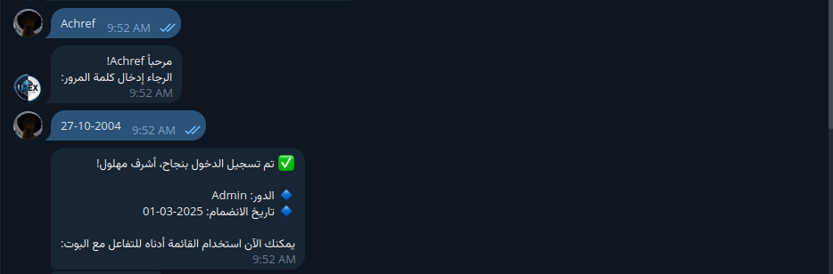
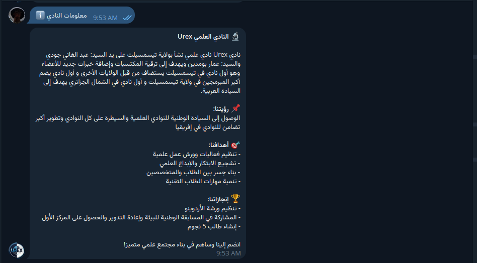
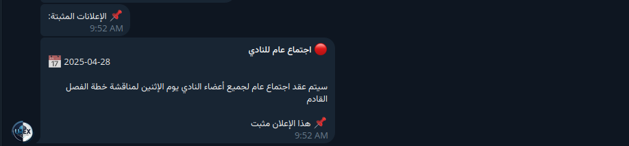
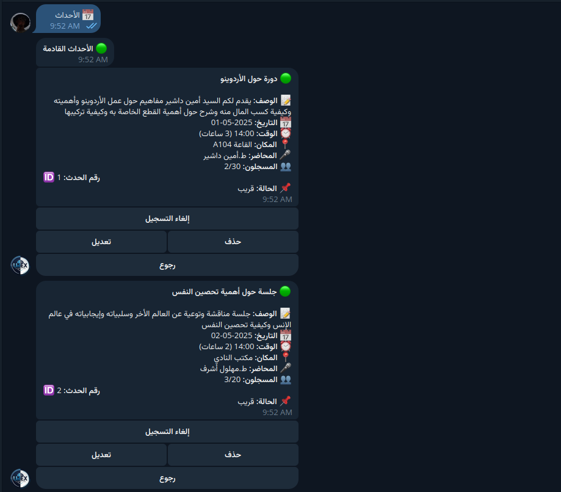
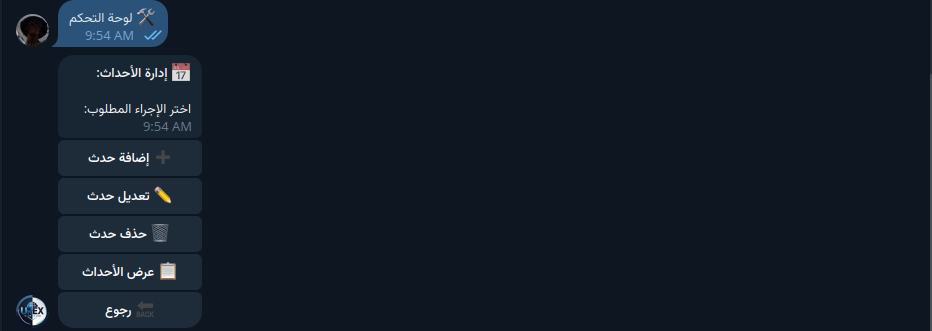
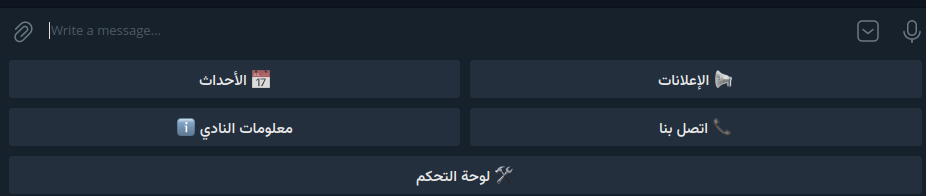

# 🤖 Urex Bot – Tissemsilt Science Club
**Telegram Bot for Club Management & Event Organization**

[]()
[]()
[]()

---

## 📌 Overview
**Urex Bot** هو بوت تيليجرام متكامل صُمم خصيصًا لإدارة أنشطة **النادي العلمي Urex** بجامعة تيسمسيلت.  
يوفر البوت تجربة تفاعلية لجميع الأعضاء والزوار، بدءًا من تصفح الأحداث القادمة، وصولًا لإدارة الإعلانات والأعضاء، مع **لوحة تحكم متقدمة** تعتمد على صلاحيات المستخدم.

---

## ✨ Main Features

### 🔐 **Secure Role-Based Login**
- نظام تسجيل دخول باسم المستخدم وكلمة المرور.
- صلاحيات متعددة: **Admin**، **Moderator**, **Member**, **Guest**.

### 📅 **Event Management**
- عرض الأحداث: القادمة، الجارية، المنتهية، الملغاة.
- التسجيل أو إلغاء التسجيل للأحداث.
- إضافة/تعديل/حذف الأحداث (للمشرفين والإداريين).

### 📢 **Announcement System**
- إنشاء إعلانات جديدة وتحديد الأولوية (عالية / متوسطة / منخفضة).
- تثبيت الإعلانات الهامة في الأعلى.
- حذف الإعلانات الغير ضرورية.

### 👥 **User Management**
- عرض قائمة الأعضاء مع بياناتهم.
- تغيير الصلاحيات (للمسؤولين فقط).

### 📊 **Statistics Dashboard**
- إجمالي وعدد الأعضاء النشطين.
- عدد الأحداث (القادمة والمنتهية).
- عدد الإعلانات المنشورة.

### ✍️ **Feedback & Suggestions**
- نموذج مخصص لإرسال الاقتراحات والملاحظات.
- إشعار المسؤولين مباشرة عند وصول ملاحظة جديدة.

---

## 🛠️ Tech Stack
- **Python 3.9+**
- [python-telegram-bot](https://python-telegram-bot.org/)
- **PicklePersistence** لتخزين البيانات بشكل دائم.
- **Logging** لتتبع الأخطاء والنشاطات.
- **Enums** لتنظيم الحالات والصلاحيات.

---

## 📦 Installation & Setup

### 1️⃣ Clone the repository
```bash
git clone https://github.com/username/urex-bot.git
cd urex-bot
```

### 2️⃣ Create a virtual environment & install dependencies
```bash
python3 -m venv venv
source venv/bin/activate   # Windows: venv\Scripts\activate
pip install -r requirements.txt
```

### 3️⃣ Configure your bot token
- أنشئ بوت من خلال [BotFather](https://t.me/BotFather) على تيليجرام.  
- انسخ **Token** وضعه في ملف `Urex.py`:
```python
updater = Updater("YOUR_BOT_TOKEN", persistence=persistence, use_context=True)
```

---

## 🚀 Usage
```bash
python Urex.py
```
ثم افتح تيليجرام وأرسل:
```
/start
```

---

## 📂 Project Structure
```
Urex/
│
├── Urex.py               # Main bot code
├── requirements.txt      # Dependencies
├── images/               # Screenshots
└── README.md             # Documentation
```

---

## 🖼️ Screenshots

### 🔐 تسجيل الدخول


### ℹ️ حول النادي


### 📅 الأحداث



### 🛠 لوحة التحكم


### 📞 اتصل بنا


### 🎛 الأزرار والقوائم


---

## 💡 Usage Workflow
1. تسجيل الدخول باسم المستخدم وكلمة المرور.
2. تصفح القائمة الرئيسية:
   - الأحداث 📅
   - الإعلانات 📢
   - معلومات النادي ℹ️
   - التواصل مع الإدارة 📞
3. إذا كنت تملك صلاحيات إدارية، يمكنك الوصول إلى لوحة التحكم 🛠.

---

## 🐞 Error Handling
- رسائل تنبيه واضحة عند حدوث خطأ.
- تسجيل جميع الأخطاء في ملف `urex_bot.log` لمراجعتها لاحقًا.

---

## 🤝 Contribution
نرحب بالمساهمات:
1. عمل Fork للمشروع.
2. إنشاء فرع جديد:
```bash
git checkout -b feature-name
```
3. رفع التعديلات عبر Pull Request.

---

## 📜 License
هذا المشروع مفتوح المصدر تحت رخصة **MIT** – يمكن استخدامه وتعديله بحرية.
